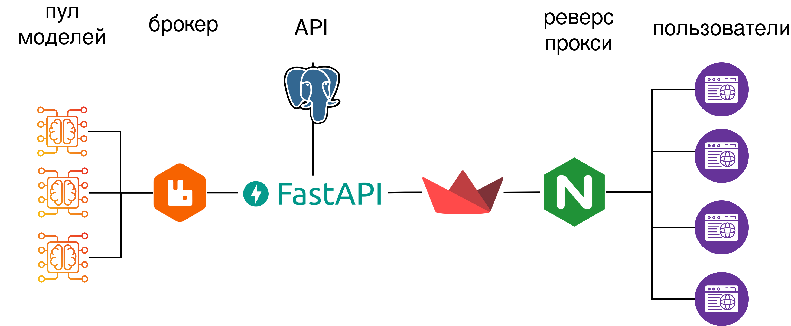

# DFU-06

[](https://docs.python.org/3/)
[](https://www.youtube.com/watch?v=dQw4w9WgXcQ&pp=ygUXbmV2ZXIgZ29ubmEgZ2l2ZSB5b3UgdXA%3D)
[](https://github.com/rudiandradi/AiTalentHack_RetailDemandForecast/tree/main)

Сервис прогнозирования спроса на розничные товары.

## Стэк

- Catboost
- Prophet
- FastAPI
- PostgreSQL
- SQLAlchemy
- Alembic
- Streamlit
- Nginx

## Архитектура сервиса



Сервис сотоит из следующих микросервисов:

- API. Обеспечивает интерфейс для взаимодействия с моделью.
- UI (Streamlit). Обеспечивает пользовательский интерфейс.
- Брокер сообщений (RabbitMQ). Обеспечивает взаимодействие микросервиса API с моделями.
- Пул моделей. Количество инстансов модели задается в настройках.

Все микросервисы контейнеризованы. Каждый инстанс модели работает в отдельном контейнере. Оркестрацией занимается Docker Compose.

## Структура проекта

- app — реализация микросервиса API
- streamlit_ui — реализация WebUI
- ml — реализация воркеров запускающих модели

## Развертывание

Конфигурация сервиса хранится в файлах docker-compose.yml и .env (должен лежать в той же директории, что и docker-compose.yml. Пример .env файла:

```
POSTGRES_DB_FILE=/run/secrets/postgres_db
POSTGRES_USER_FILE=/run/secrets/postgres_user
POSTGRES_PASSWORD_FILE=/run/secrets/postgres_password
DB_HOST=db
DB_PORT=5433
RABBITMQ_USER=rmuser
RABBITMQ_PASSWORD=rmpassword
RABBITMQ_HOST=rabbitmq
RABBITMQ_PORT=5672
RABBITMQ_UI_PORT=15672
RABBITMQ_DISK_FREE_LIMIT=2147483648
REDIS_HOST=redis
REDIS_PORT=6379
APP_HOST=app
APP_PORT=8000
STREAMLIT_SERVER_PORT=8502
ALEMBIC_CONFIG=/app/alembic.ini
SECRETS_DIR=/run/secrets
COOKIE_NAME=mlbilling
```

Переменные POSTGRES_DB_FILE, POSTGRES_USER_FILE, POSTGRES_PASSWORD_FILE указывают расположене секретов внутри запущенного контейнера PostgreSQL.

Кроме того для запуска проекта в директорию postgres нужно поместить файлы db.secret, password.secret, user.secret, которые содержат название базы данных, пароль к базе данных, имя пользователя базы данных, соответственно.

После того как все файлы помещены на положенные им места и заполнены, нужно из корня проекта выполнить команду

```shell
docker compose up
```
